# Azure Architecture Diagrams

This document shows both the intentionally inefficient Azure architecture and the optimized version for the Agentic Hike Planner application.

## Current Inefficient Architecture

This diagram shows the over-provisioned, wasteful architecture designed to demonstrate cost optimization opportunities:

```mermaid
%%{init: {'theme':'base', 'themeVariables': { 'primaryColor': '#ff6b6b', 'primaryTextColor': '#fff', 'primaryBorderColor': '#ee5a24', 'lineColor': '#8395a7', 'secondaryColor': '#feca57', 'tertiaryColor': '#ff9ff3', 'background': '#ffffff', 'mainBkg': '#ffffff', 'secondBkg': '#f8f9fa', 'tertiaryBkg': '#e9ecef'}}}%%
graph TB
    %% User Layer
    Users[🧗 Hikers & Outdoor Enthusiasts] --> CDN
    
    %% Frontend Infrastructure
    CDN[🌐 Azure CDN<br/>Standard Tier<br/>🔴 $20/month<br/>Unnecessary for demo]
    CDN --> SWA[📱 Static Web App<br/>React TypeScript<br/>🟢 Free Tier]
    
    %% API Gateway (Overkill)
    SWA --> AG[🚪 Application Gateway<br/>Standard v2<br/>🔴 $50/month<br/>Overkill for single backend]
    
    %% Compute Layer (Over-provisioned)
    AG --> ASP[💻 App Service Plan<br/>Standard S3<br/>🔴 $150/month<br/>4 cores, 7GB RAM]
    ASP --> API[🛠️ Hiking API<br/>Node.js/TypeScript<br/>Trail recommendations]
    
    AG --> FP[⚡ Function Premium<br/>EP1 Plan<br/>🔴 $150/month<br/>Always-on premium]
    FP --> FA[🤖 AI Functions<br/>Image analysis<br/>Weather processing]
    
    %% Data Layer (Multiple redundant DBs)
    API --> COSMOS[🌍 Cosmos DB<br/>SQL API<br/>🔴 $60/month<br/>1,000 RU/s provisioned]
    API --> SQLDB[🗄️ SQL Database<br/>Standard S2<br/>🔴 $75/month<br/>50 DTU over-provisioned]
    API --> REDIS[⚡ Redis Cache<br/>Basic C1<br/>🟡 $45/month<br/>Redundant caching]
    
    %% Storage (Multiple accounts)
    API --> STOR1[💾 Storage Account 1<br/>🟡 $20/month<br/>Trail data - Hot tier]
    FA --> STOR2[💾 Storage Account 2<br/>🟡 $20/month<br/>Images - Hot tier]
    SWA --> STOR3[💾 Storage Account 3<br/>🟡 $20/month<br/>Static assets]
    
    %% Supporting Services
    API --> B2C[🔐 Azure AD B2C<br/>Premium P1<br/>🟡 $15/month<br/>Unused premium features]
    API --> KV[🔑 Key Vault<br/>🟡 $20/month<br/>High operation count]
    API --> AIFO[🧠 AI Foundry<br/>GPT-4o-mini<br/>🟢 Pay-per-use]
    FA --> CV[👁️ Computer Vision<br/>🟢 Free Tier]
    
    %% Monitoring
    API --> MON[📊 Application Insights<br/>🟡 $25/month<br/>5GB/day ingestion]
    FA --> MON
    COSMOS --> MON
    SQLDB --> MON
    
    %% Cost indicator styles
    classDef expensive fill:#ff6b6b,stroke:#ee5a24,stroke-width:3px,color:#fff
    classDef wasteful fill:#feca57,stroke:#f39801,stroke-width:2px,color:#2c3e50
    classDef efficient fill:#00b894,stroke:#00a085,stroke-width:2px,color:#fff
    classDef free fill:#74b9ff,stroke:#0984e3,stroke-width:2px,color:#fff
    
    class CDN,AG,ASP,FP,COSMOS,SQLDB expensive
    class REDIS,STOR1,STOR2,STOR3,B2C,KV,MON wasteful
    class API,FA efficient
    class SWA,AIFO,CV free
```

## Optimized Architecture

This diagram shows the cost-optimized architecture with right-sized resources and consolidated services:

```mermaid
%%{init: {'theme':'base', 'themeVariables': { 'primaryColor': '#00b894', 'primaryTextColor': '#fff', 'primaryBorderColor': '#00a085', 'lineColor': '#74b9ff', 'secondaryColor': '#a29bfe', 'tertiaryColor': '#fd79a8', 'background': '#ffffff', 'mainBkg': '#ffffff', 'secondBkg': '#f8f9fa', 'tertiaryBkg': '#e9ecef'}}}%%
graph TB
    %% User Layer
    Users[🧗 Hikers & Outdoor Enthusiasts] --> SWA
    
    %% Frontend (Direct connection)
    SWA[📱 Static Web App<br/>React TypeScript<br/>🟢 Free Tier<br/>Built-in CDN]
    
    %% Simplified Backend
    SWA --> ASP[💻 App Service Plan<br/>Basic B2<br/>🟢 $30/month<br/>Right-sized: 2 cores, 3.5GB]
    ASP --> API[🛠️ Hiking API<br/>Node.js/TypeScript<br/>All features consolidated]
    
    %% Serverless Functions
    SWA --> FA[⚡ Azure Functions<br/>Consumption Plan<br/>🟢 $5/month<br/>Pay-per-execution]
    
    %% Optimized Data Layer
    API --> COSMOS[🌍 Cosmos DB<br/>Serverless<br/>🟢 $25/month<br/>Auto-scaling RU/s]
    
    %% Consolidated Storage
    API --> STOR[💾 Storage Account<br/>🟢 $15/month<br/>Lifecycle policies<br/>Hot/Cool/Archive tiers]
    FA --> STOR
    SWA --> STOR
    
    %% Essential Services Only
    API --> B2C[🔐 Azure AD B2C<br/>🟢 Free Tier<br/>50K users included]
    API --> KV[🔑 Key Vault<br/>🟢 $5/month<br/>Essential secrets only]
    API --> AIFO[🧠 AI Foundry<br/>GPT-4o-mini<br/>🟢 Pay-per-use]
    FA --> CV[👁️ Computer Vision<br/>🟢 Free Tier]
    
    %% Right-sized Monitoring
    API --> MON[📊 Application Insights<br/>🟢 $5/month<br/>1GB/day ingestion]
    FA --> MON
    COSMOS --> MON
    
    %% Auto-scaling indicators
    ASP -.->|Auto-scale| ASP
    COSMOS -.->|Serverless| COSMOS
    FA -.->|Consumption| FA
    
    %% Cost styles for optimized architecture
    classDef optimized fill:#00b894,stroke:#00a085,stroke-width:2px,color:#fff
    classDef free fill:#74b9ff,stroke:#0984e3,stroke-width:2px,color:#fff
    classDef minimal fill:#a29bfe,stroke:#6c5ce7,stroke-width:2px,color:#fff
    
    class ASP,COSMOS,STOR optimized
    class SWA,B2C,AIFO,CV free
    class API,FA,KV,MON minimal
```

## Cost Comparison Analysis

### Architecture Transformation Summary

| Metric | Inefficient Architecture | Optimized Architecture | Improvement |
|--------|-------------------------|------------------------|-------------|
| **Monthly Cost** | ~$900 | ~$85 | 📉 90% reduction |
| **Daily Demo Cost** | ~$30 | ~$3 | 📉 90% reduction |
| **Resource Count** | 15+ services | 8 services | 📉 47% fewer |
| **Storage Accounts** | 3 separate accounts | 1 consolidated | 📉 67% reduction |
| **Compute Over-provisioning** | 4-7GB RAM, always-on | Auto-scale, right-sized | 📉 75% reduction |

### Key Optimization Strategies Demonstrated

#### 🔴 High-Impact Changes (75% of savings)
1. **Remove Application Gateway** ($50/month → $0)
   - Direct SWA to API routing
   - Eliminates unnecessary network layer

2. **Right-size App Service Plan** ($150/month → $30/month)
   - Standard S3 → Basic B2
   - Match capacity to actual usage

3. **Switch to Consumption Functions** ($150/month → $5/month)
   - Premium EP1 → Consumption plan
   - Pay only for execution time

4. **Optimize Database Strategy** ($135/month → $25/month)
   - Remove redundant SQL Database
   - Use Cosmos DB serverless instead of provisioned

#### 🟡 Medium-Impact Changes (20% of savings)
5. **Consolidate Storage** ($60/month → $15/month)
   - 3 storage accounts → 1 with lifecycle policies
   - Implement automatic tiering (Hot/Cool/Archive)

6. **Remove Redundant Caching** ($45/month → $0)
   - Eliminate Redis cache
   - Use built-in application caching

#### 🟢 Low-Impact Changes (5% of savings)
7. **Optimize Monitoring** ($25/month → $5/month)
   - Reduce log ingestion volume
   - Focus on essential metrics

8. **Use Free Tier Services** ($35/month → $0)
   - Azure AD B2C Free tier
   - Remove unnecessary CDN (SWA has built-in CDN)

### Total Optimization Potential

| Phase | Current Cost | Optimized Cost | Savings | Percentage |
|-------|--------------|----------------|---------|------------|
| **Phase 1: Remove Redundancies** | $900 | $650 | $250 | 28% |
| **Phase 2: Right-size Resources** | $650 | $200 | $450 | 69% |
| **Phase 3: Use Consumption Models** | $200 | $85 | $115 | 58% |
| **📊 Total Transformation** | **$900** | **$85** | **$815** | **90%** |

### Demo Value Proposition

This architecture comparison demonstrates:

✅ **Real-world scenarios** - Common over-provisioning patterns  
✅ **Significant savings** - 90% cost reduction potential  
✅ **Budget-friendly testing** - $3/day optimized vs $30/day inefficient  
✅ **Multiple optimization strategies** - From infrastructure to consumption models  
✅ **Measurable impact** - Clear before/after metrics  

The dual architecture approach shows both the problem (expensive, over-provisioned) and the solution (optimized, right-sized), making it perfect for demonstrating Azure cost optimization workflows.

## Demo Cost Management & Safety

### 💰 Daily Cost Breakdown
| Environment | Inefficient | Optimized | Notes |
|-------------|-------------|-----------|-------|
| **Production** | $30/day | $3/day | Core demo environment |
| **Development** | $7/day | $1/day | Can be shut down when not demoing |
| **Staging** | $2/day | $0.50/day | On-demand only |
| **Total Maximum** | **$39/day** | **$4.50/day** | All environments running |

### 🛡️ Cost Protection Strategies
1. **⏰ Auto-cleanup**: Resources auto-delete after 24 hours
2. **🚨 Budget alerts**: Notifications at $25, $50, $75 spending
3. **📅 Scheduled shutdown**: Non-prod environments auto-stop at 6 PM
4. **🆓 Free tier maximization**: SWA, AI services, B2C, monitoring base tiers
5. **📊 Real-time monitoring**: Cost tracking dashboard with hourly updates

### 🎯 Demo Success Metrics
- **Cost reduction demonstrated**: 90%+ savings potential
- **Resource optimization**: 47% fewer services needed  
- **Performance maintained**: Same functionality, better efficiency
- **Daily demo budget**: Under $30 (inefficient) or $5 (optimized)

This setup provides a realistic, budget-conscious way to demonstrate significant Azure cost optimization opportunities while maintaining demo affordability.
